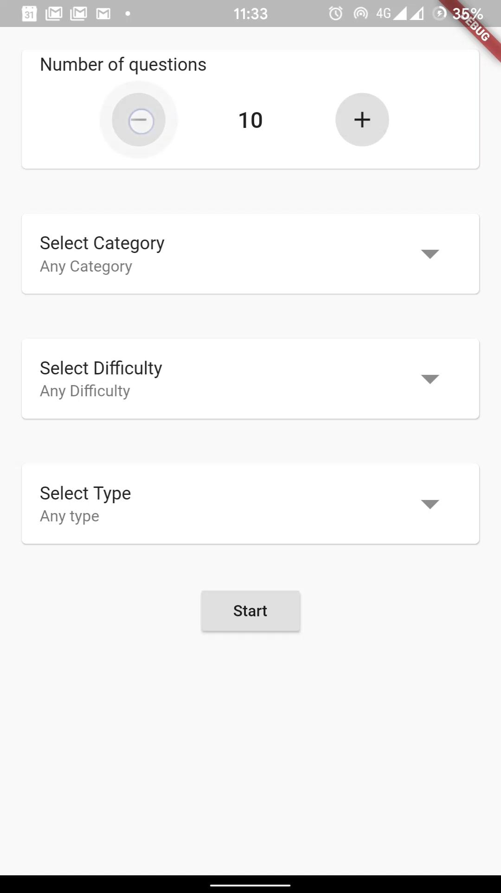
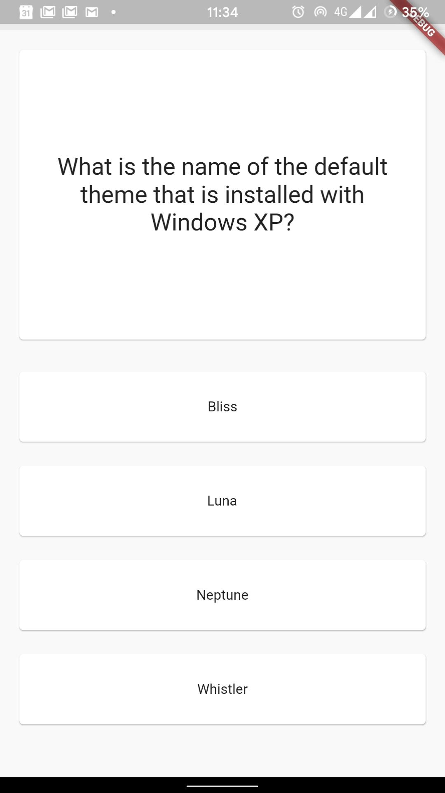
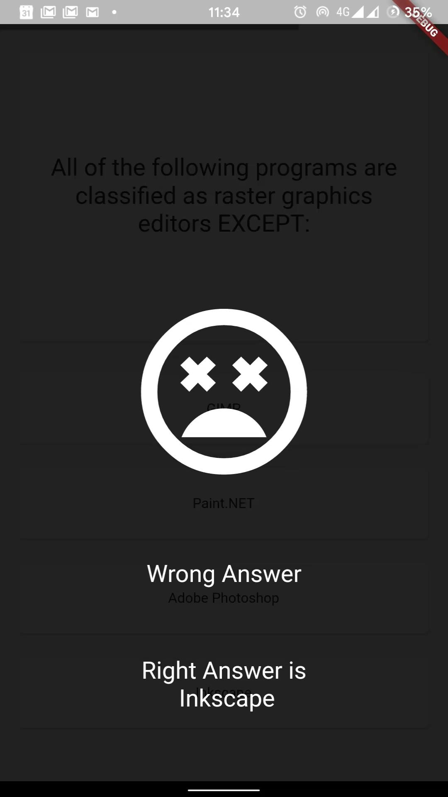
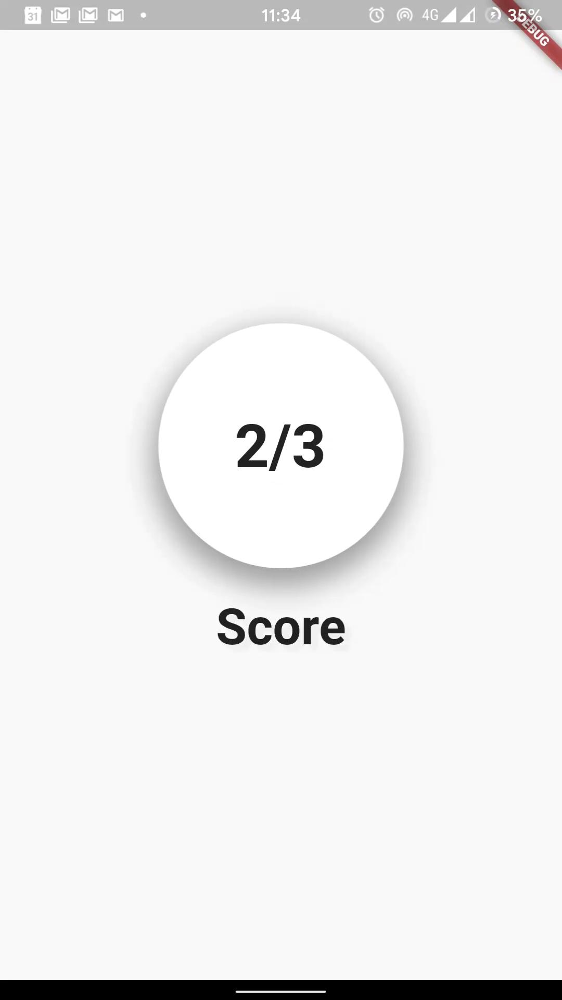
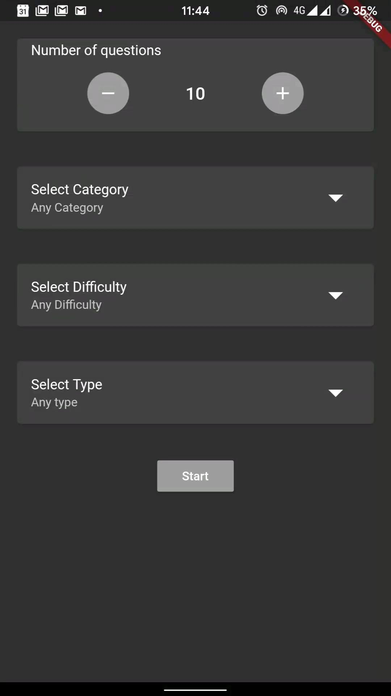
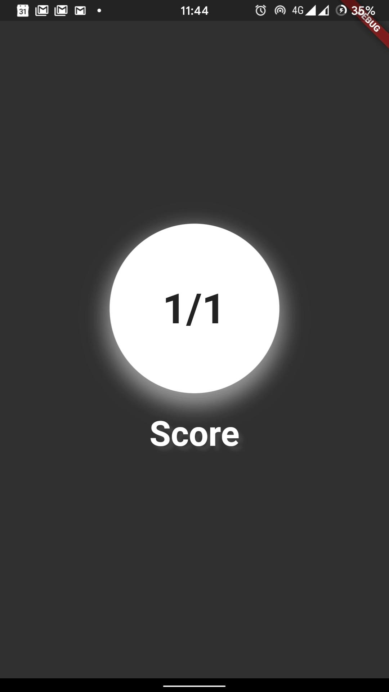

# Quiz
A quiz app in flutter.

### Features
- Most 50 number of questions
- 25 categories of questions
- 3 difficulty levels
- *MCQ* or *True-False* type questions
- Support native *Dark Theme*

### Demo
**Light Theme**

    
    
    
    

**Dark Theme**

    
    
    
    

### Credits
- Using [Open Trivia Database](https://opentdb.com/)
**Quiz API** to get the questions.
- Idea was taken from a
[video](https://www.youtube.com/watch?v=jBBl1tYkUnE)
by [**Bram Vanbilsen**](https://www.youtube.com/user/BramVanbilsen)

### Install
Download the *.apk* file from [here](https://github.com/RitamChakraborty/quiz/releases/download/v1.0/app-release.apk)

