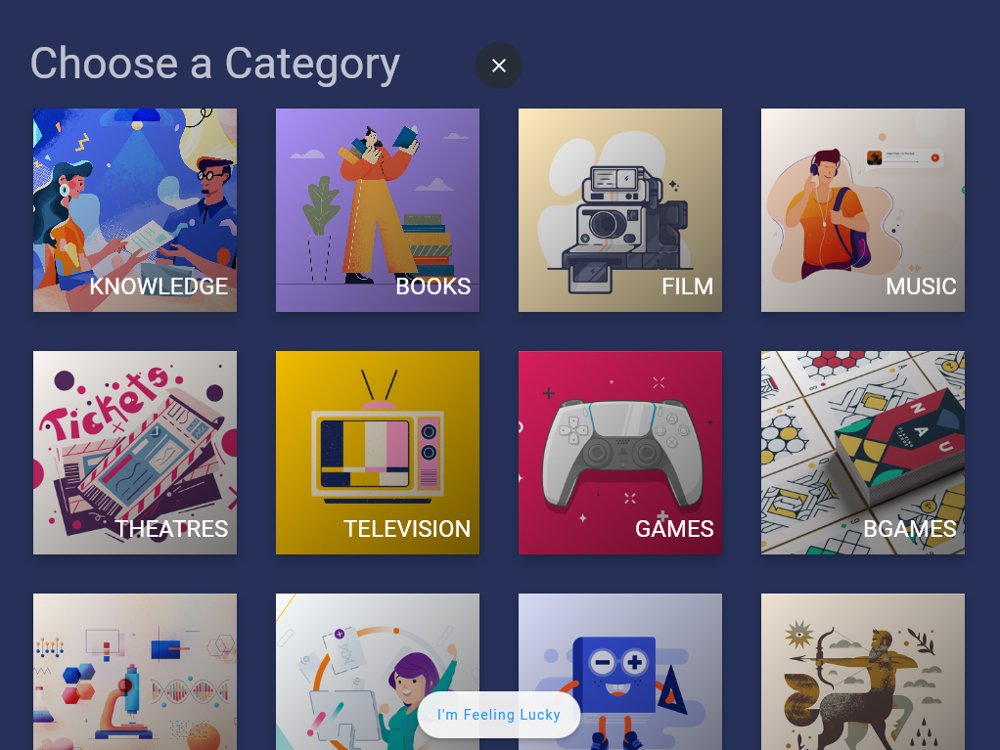
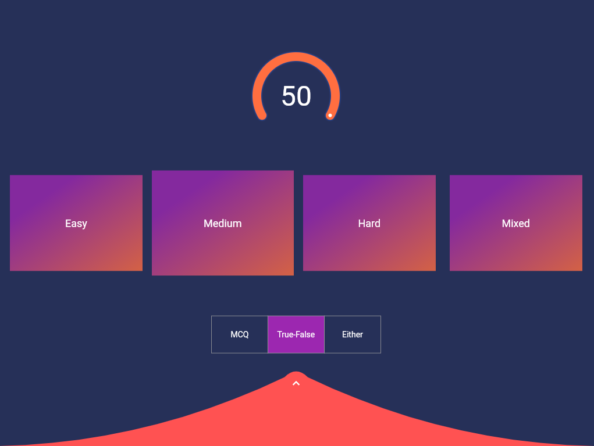
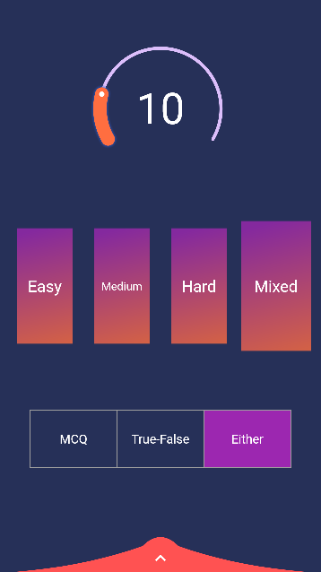
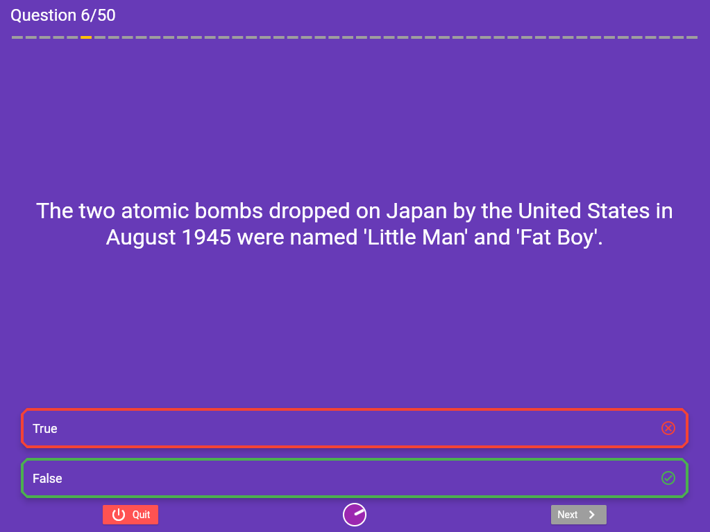
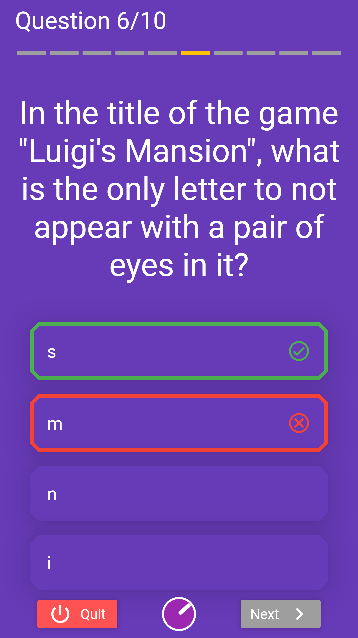
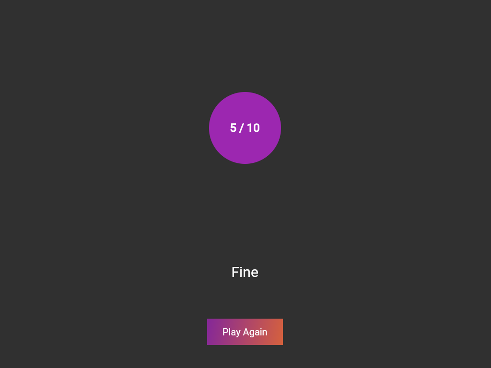

# Quiz

A quiz app in flutter.

### Features

- Most 50 number of questions
- 25 categories 
- 3 difficulty levels
- *MCQ* or *True-False* type questions
- 45 seconds timer for every question

### Demo

    
    

    
    

    
    

    
    

### Credits

- Using [Open Trivia Database](https://opentdb.com/)
**Quiz API** to get the questions.
- Idea was taken from a
[video](https://www.youtube.com/watch?v=jBBl1tYkUnE)
by [**Bram Vanbilsen**](https://www.youtube.com/user/BramVanbilsen)

### Install

Visit the web app from [here](https://ritamchakraborty.github.io/quiz/#/)

Or download the *.apk* file from [here](https://github.com/RitamChakraborty/quiz/releases/download/v2.0-beta/app-release.apk)

